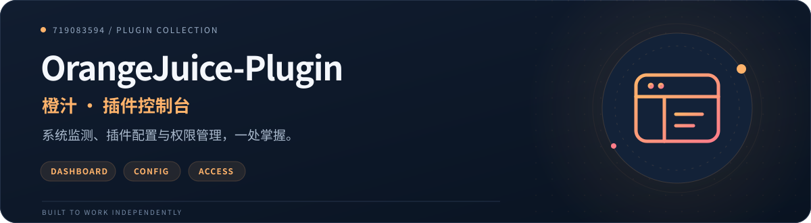
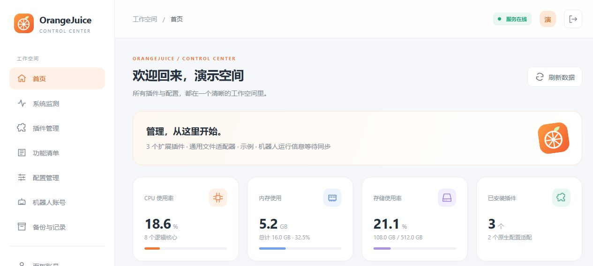
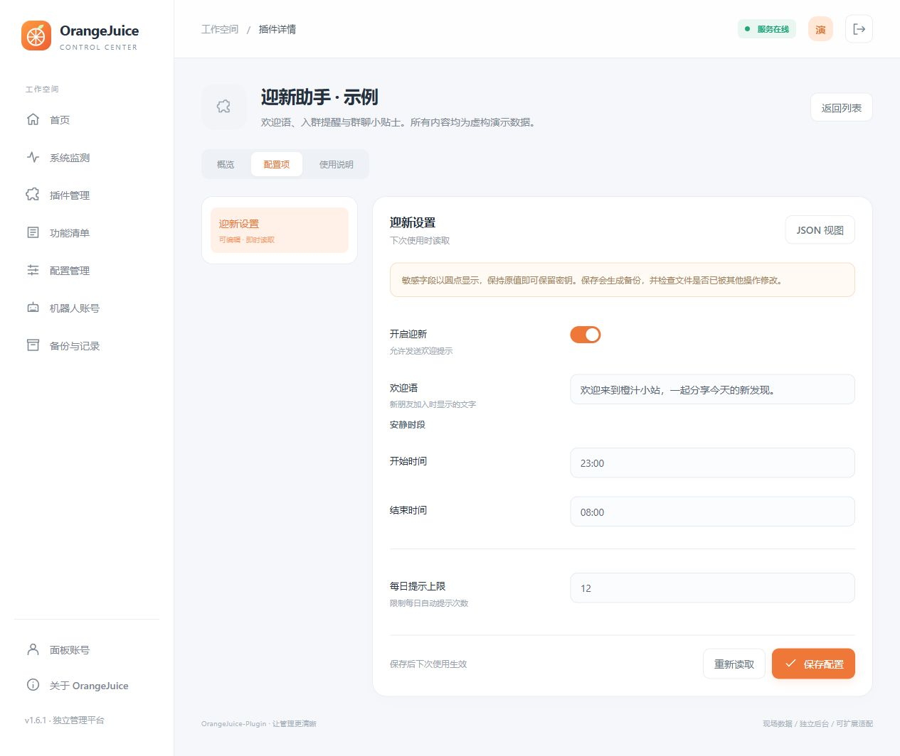

# OrangeJuice-Plugin



让系统状态、插件配置和访问权限，在一个独立工作空间里各就其位。

[效果预览](#效果预览) · [功能](#功能) · [安装](#安装) · [配置和权限](#配置和权限) · [检查与开发](#检查与开发) · [许可证](#致敬与许可证)

## 效果预览



首页概览（局部）。截图来自仓库现有网页，由[只读演示脚本](scripts/readme-demo.mjs)提供虚构插件、主机指标与配置；未连接机器人，不代表真实运行数据。

<details>
<summary>展开查看配置表单</summary>



示例展示字段说明、开关、嵌套配置和保存入口；演示服务只允许读取，不会修改实际配置。

</details>

| 一个工作空间 | 清晰的配置编辑 | 分工明确的权限 |
| --- | --- | --- |
| 系统状态、插件主页、功能清单与管理入口集中呈现。 | JSON / YAML 字段表单、密钥遮罩、校验与保存前自动备份。 | 主人、管理员、观察员各有边界，通用核心可独立运行。 |

## 功能

| 页面 | 功能 |
| --- | --- |
| 首页 | CPU、内存、存储、插件数量、框架信息与管理入口 |
| 系统监测 | 磁盘、交换内存、网络累计流量、Docker 容器、进程内存 |
| 插件管理 | 名称、图标、作者、版本、主页、说明、配置、安装、更新与卸载 |
| 功能清单 | 已注册命令、通知事件、钩子、定时任务、模块来源及入口重叠提示 |
| 配置管理 | JSON/YAML 逐字段表单、原始 JSON 编辑、范围校验、密钥遮罩、覆盖冲突检查 |
| 机器人账号 | 连接状态、好友与群列表，由框架适配器同步 |
| 面板账号 | 主人、管理员、观察员角色与密码管理 |
| 备份与记录 | 保存前自动备份、恢复、操作审计 |

登录支持账号密码、控制台验证码、主人私聊临时链接。临时链接三分钟内一次有效，验证码五分钟内一次有效。

“功能清单”默认显示框架内置功能。云崽桥接会同步欢迎新人、退群通知、系统命令、自动任务等注册信息；可按名称、来源文件、事件和类型筛选，也可切换“全部功能”对照扩展插件。相同名称或相同规则且事件范围交叉时会提示可能重叠，实际执行仍取决于优先级和插件内部判断。

清单读取框架注册表，不执行插件或触发规则。“默认状态”对应群聊默认启用 / 禁用列表，单个账号、群的覆盖配置需在“打开群聊配置”中核对；定时任务和初始化模块不受该列表控制。没有注册为入口的内部辅助方法及外部服务功能不在此清单中。其他框架可按适配协议提供功能快照；没有快照时明确显示未提供，不推断为零个功能。

## 安装

Python 3.10+ 是管理服务运行环境。Git 用于安装和更新插件。可选云崽桥接组件使用框架现有的 Node.js 环境。

```bash
git clone https://github.com/719083594/OrangeJuice-Plugin.git
cd OrangeJuice-Plugin
python -m venv .venv
# Linux/macOS
source .venv/bin/activate
# Windows PowerShell: .venv\Scripts\Activate.ps1
python -m pip install -r requirements.txt
python scripts/install.py --framework-root /path/to/framework --plugins-directory /path/to/framework/plugins
python -m orangejuice.server serve --config config/local.json --data data
```

打开 `http://127.0.0.1:15082/#/home`。首次账号密码写在 `data/bootstrap.txt`，账号密码登录成功后该文件自动删除。也可点击登录页“获取控制台验证码”，在服务控制台查看，或在同一服务环境执行：

```bash
python -m orangejuice.server ticket --config config/local.json --data data
```

下载 Releases 中的完整 ZIP 后解压，可执行同样的安装步骤。ZIP 包含前后端、适配器、安装脚本、依赖清单、测试及文档。

### 云崽 V3 / TRSS-Yunzai

管理核心放在机器人目录外，桥接组件放在 `plugins/OrangeJuice-Plugin`：

```bash
python scripts/install.py --framework-root /path/to/yunzai --yunzai-bridge --public-url http://127.0.0.1:15082
```

重启机器人后，主人私聊发送 `#橙汁登录` 或 `/橙汁登录` 获取入口；`#橙汁帮助` 查看帮助。群内登录命令只提示转到私聊。

安装 AI-Plugin 的共享静态图片读取服务并包含仓库 `resources/help/` 发布资源时，`#橙汁帮助` 直接发送已校验的本地固定帮助图，无需浏览器或在线渲染。`#橙汁帮助 文字` 查看文字版；缺少图片或共享服务时保留文字帮助。权限仍限机器人主人私聊，帮助图不含真实服务地址、登录票据或配置。桥接组件安装时将 `integrations/yunzai/` 平铺到 `plugins/OrangeJuice-Plugin/`，并复制 `resources/help/` 至该插件的同名目录；额外保留公开源码 `integrations/yunzai/help-content.mjs`，供图片清单按仓库路径校验。

Docker 部署应让管理服务与机器人共享 `data/orangejuice` 目录。管理服务的 `bridgeDirectory` 和 `runtimeFile` 使用宿主机路径；桥接组件使用容器内路径。详见 [部署说明](docs/DEPLOYMENT.md)。

### 其他框架

核心通过配置目录与声明文件工作，可独立用于其他插件式应用。JSON/YAML 配置可自动发现；数据库、JavaScript 动态配置及自定义动作需要框架或插件提供适配。详见 [适配协议](docs/ADAPTERS.md)。

管理核心不依赖云崽、QQ 或 Node.js；通用文件适配支持插件清单、JSON/YAML 编辑、账号权限和配置备份。只有主动安装 `integrations/yunzai` 才需要云崽。其他框架的在线账号、好友群列表、加载功能计数和私聊登录需要实现运行信息与登录协议；未接入时显示“未提供/过期”，不推断在线状态。

其他应用可使用自己的配置目录，例如：

```bash
python scripts/install.py --framework-root /srv/my-app \
  --plugins-directory /srv/my-app/extensions \
  --framework-configs-directory /srv/my-app/settings
```

不指定配置目录时保留云崽兼容默认路径 `config/config`；应用根目录之外的个别配置通过 `extraConfigs` 显式登记。新版配套项目 [ServerStatus-Plugin](https://github.com/719083594/ServerStatus-Plugin) 和 [WebSearch-Plugin](https://github.com/719083594/WebSearch-Plugin) 均提供独立核心、CLI 和可选云崽适配器。

## 配置和权限

`config/local.json` 是实例配置。`config/example.json` 提供通用示例。配置保存返回生效方式；标注“重启”的配置在相应服务重启后生效。

主人可管理账号、服务动作及插件安装；管理员可编辑一般配置、查看备份与审计；观察员查看状态和遮罩后的配置。敏感后台及框架配置仅主人可改，恢复备份也仅主人可执行。

管理地址、框架名称与常见配置字段提供中文名称。插件声明的中文字段同样适用于嵌套对象和对象数组；模型渠道与角色预设可逐项添加、删除和编辑，密钥按稳定标识保留。AI-Plugin 等插件可声明 `ownerOnly`、独立管理入口及只读功能清单，明确显示已实现、待配置和计划功能。详见 [适配协议](docs/ADAPTERS.md)。

默认保护 `chatgpt-plugin`，其配置只读。已有 AI 服务的管理入口可通过 `externalPanels` 接入。配置文件的所有已有字段可编辑，声明中可以给每个字段添加名称、说明和校验。YAML 保存会重新排版并去掉注释，请保留自动备份。

升级时保留 `config/local.json` 与 `data`。替换程序文件后重启管理服务；不要用示例覆盖实例配置。

## 检查与开发

```bash
python -m orangejuice.server diagnose --config config/local.json --data data
python -m unittest discover -s tests -v
node --check web/app.js
node --check integrations/yunzai/index.js
node --test tests/*.test.mjs
```

接口列表见 [API](docs/API.md)，锅巴接口调研与对应关系见 [调研报告](docs/GUOBA-RESEARCH.md)。本项目使用独立 API，不替代其他程序对锅巴 API 的调用；原有 `guoba.support.js` 配置回调需迁移为橙汁声明或适配器。

## 致敬与许可证

感谢 Guoba-Plugin 与 Guoba 的前端项目提供管理流程研究参考；感谢 TRSS-Yunzai、Yunzai-Bot、ChatGPT-Plugin 及实际依赖 psutil、PyYAML。使用范围与来源见 [致敬](docs/CREDITS.md) 与 [第三方说明](THIRD_PARTY_NOTICES.md)。

独立管理核心和网页采用 [PolyForm Noncommercial 1.0.0](LICENSE)，允许其许可范围内的非商业使用、修改和分享。`integrations/yunzai` 是单独采用 GPL-3.0-or-later 的可选组件；该组件遵守 GPL，其许可不附加非商业限制。第三方项目各自遵循原许可证。

## 插件组合与入口

OrangeJuice 的 Python 服务独立运行，系统监测使用自己的采集模块，配置目录、插件清单和外部工作台按实例设置登记。AI、WebSearch、ServerStatus 均为可选管理对象，缺少这些插件不会阻止面板启动。面板读取和修改配置，不代替插件处理聊天、搜索或状态命令。

云崽桥接仅提供主人登录和运行信息同步；独立部署可以通过网页登录使用面板。外部工作台链接需对应服务在线，停用该服务不影响面板其他页面。


## 管理页面分工

| 页面 | 内容 |
| --- | --- |
| 插件管理 | 外置插件的主页、介绍、指令、独立配置和项目链接 |
| 功能清单 | 全部登记功能；框架自带功能统一归为“内置插件”，外置功能按插件分组 |
| 配置管理 | OrangeJuice 平台设置和机器人桥接设置 |

功能清单逐项显示用途、操作指令、事件、权限说明、配置文件与字段。原始触发规则和内部钩子保留在折叠详情中；事件自动触发和初始化模块明确标注没有聊天指令。同一个入口可以有多个不同用途的操作，不会把多个规则当作重复功能删除。

内置配置从功能清单进入，保留框架的全部实际字段。外置插件的字段名称和解释来自插件声明，未声明字段可在配置表单查看；AI 等插件提供的能力声明同时标明已实现、待配置或计划功能。聊天命令以实例配置的前缀为准。

平台设置仅主人可保存；需要重新启动管理服务才会应用。服务命令、外部登录程序、额外文件接入等部署定义继续在实例文件中配置，平台表单保存会完整保留这些定义。升级保留实例配置、账号和历史数据。

内置指令说明见 [功能说明](docs/FUNCTION-CATALOG.md)。


## 功能、指令与配置

插件管理包含每个外置插件以及统一的「内置插件」。进入概览可查看实际登记的功能、指令、用途、权限与配置入口。配置页显示功能名称、说明和值；内部字段路径与接入声明不作为设置展示。尚未实现的功能会注明状态。

主人私聊指令（也支持 `/`）：

| 指令 | 用途 |
| --- | --- |
| `#橙汁登录` | 获取一次性面板登录入口 |
| `#橙汁帮助` | 查看命令说明 |
| `#橙汁功能` | 查看内置功能默认开关 |
| `#橙汁功能 欢迎新人 关` | 关闭默认自动欢迎；账号或群单独设置仍优先 |
| `#橙汁配置` | 查看可配置插件 |
| `#橙汁配置 AI` | 查看 AI 配置，默认每页 10 项 |
| `#橙汁配置 搜索 2` | 查看搜索配置第二页 |
| `#橙汁配置 内置插件 自动同意好友` | 按功能设置名称查询 |
| `#橙汁设置 插件名 选项编号 @版本 值` | 修改设置；完整指令从查询结果或配置页复制 |

插件名可使用 `AI`、`搜索`、`系统`、`橙汁`、`内置插件`，也可使用插件名称。复制指令后替换末尾的值再发送；支持 JSON 数字、数组、对象、文本，以及布尔值「开 / 关」。数组用 JSON 形式修改，例如 `["欢迎新人"]`；密钥只在主人私聊设置，查询时始终遮罩。配置已变化时需重新查询，避免改错数组项。只读和计划功能不可由命令修改。保存与面板共用校验、版本检查和备份流程。

在橙汁的机器人桥接设置中，可添加「自定义指令」与「原始指令」，例如 `/查天气` → `#搜索`。发送 `/查天气 北京天气` 会交给原始搜索功能处理，原始权限和限流继续生效。每条消息只映射一次；自定义指令即时读取，连接参数修改后重启机器人。内置自动事件通过功能开关与共享设置配置；模块加载和定时任务在对应配置项管理。

## 功能指令表

发送 `#指令`、`/指令`、`#指令表` 或 `/指令表`，机器人遍历当前已加载的消息插件，按聊天与角色、搜索与资料、图片与媒体、记忆与词条、群聊与消息、系统与状态、配置与管理、维护与更新等功能分类返回指令。

群聊（包括主人在群内查询）和普通用户私聊显示公开表，隐藏仅主人使用的指令。主人私聊显示完整表。当前账号或群关闭的功能不会进入该次查询的表。自动通知、定时任务和没有聊天入口的模块仍在面板功能清单中展示，不作为可发送的指令。

支持合并转发，平台不支持时改发完整文字。机器人桥接配置中可调整指令表开关、查询冷却和合并转发，也可通过 `#橙汁配置 橙汁 指令表` 获取 QQ 配置命令。该查询直接读取插件注册实例及配置声明；OrangeJuice 管理服务暂时不可用时，指令表仍可使用。

### 其他插件提供指令说明

已登记的新插件会自动被扫描。可在注册规则中提供 `command`（完整命令示例）、`title`、`description`、`permission`，或在 `orangejuice.plugin.json` 中提供 `commandTable` 数组：

```json
{
  "commandTable": [
    {"title": "天气查询", "command": "#天气 城市", "description": "查询当前天气", "permission": "all"},
    {"title": "服务维护", "command": "#服务维护", "description": "仅主人执行维护", "permission": "master"}
  ]
}
```

说明只有匹配实际注册规则时才会显示。未提供示例的指令显示真实触发规则；没有明确权限的未知处理函数若包含主人检查，公开表会保守隐藏，主人私聊可见。请为一个处理函数内不同权限的子命令分别声明权限。自定义别名继承原指令的权限；未知目标不会进入表。

内置插件及本项目适配的插件使用与面板相同的功能说明，修改说明后运行 `python scripts/export-command-docs.py` 更新机器人提示数据。
