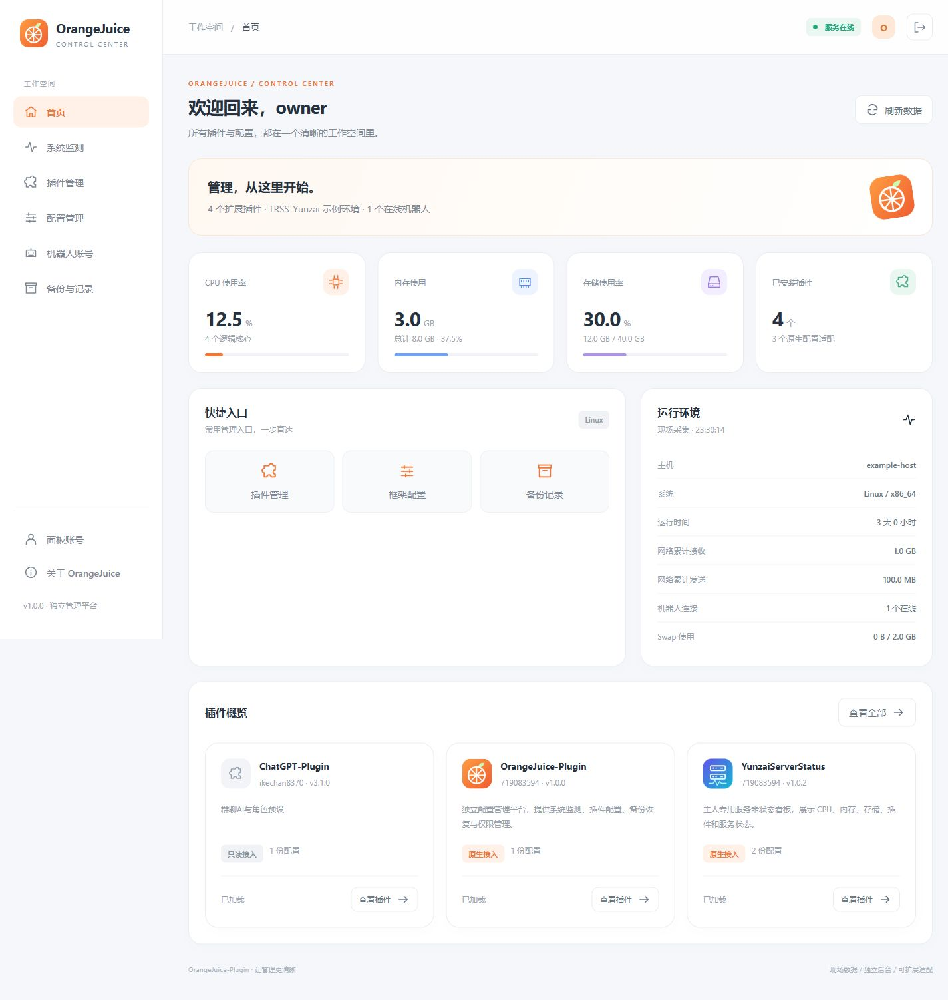

# OrangeJuice-Plugin

橙汁是一套独立运行的插件管理平台。它把系统状态、插件主页、配置编辑、机器人连接、账号权限与配置备份放在同一个工作空间。



预览使用示例数据。

## 功能

| 页面 | 功能 |
| --- | --- |
| 首页 | CPU、内存、存储、插件数量、框架信息与管理入口 |
| 系统监测 | 磁盘、交换内存、网络累计流量、Docker 容器、进程内存 |
| 插件管理 | 名称、图标、作者、版本、主页、说明、配置、安装、更新与卸载 |
| 配置管理 | JSON/YAML 逐字段表单、原始 JSON 编辑、范围校验、密钥遮罩、覆盖冲突检查 |
| 机器人账号 | 连接状态、好友与群列表，由框架适配器同步 |
| 面板账号 | 主人、管理员、观察员角色与密码管理 |
| 备份与记录 | 保存前自动备份、恢复、操作审计 |

登录支持账号密码、控制台验证码、主人私聊临时链接。临时链接三分钟内一次有效，验证码五分钟内一次有效。

## 安装

Python 3.10+ 是管理服务运行环境。Git 用于安装和更新插件。可选云崽桥接组件使用框架现有的 Node.js 环境。

```bash
git clone https://github.com/719083594/OrangeJuice-Plugin.git
cd OrangeJuice-Plugin
python -m venv .venv
# Linux/macOS
source .venv/bin/activate
# Windows PowerShell: .venv\Scripts\Activate.ps1
python -m pip install -r requirements.txt
python scripts/install.py --framework-root /path/to/framework --plugins-directory /path/to/framework/plugins
python -m orangejuice.server serve --config config/local.json --data data
```

打开 `http://127.0.0.1:15082/#/home`。首次账号密码写在 `data/bootstrap.txt`，账号密码登录成功后该文件自动删除。也可点击登录页“获取控制台验证码”，在服务控制台查看，或在同一服务环境执行：

```bash
python -m orangejuice.server ticket --config config/local.json --data data
```

下载 Releases 中的完整 ZIP 后解压，可执行同样的安装步骤。ZIP 包含前后端、适配器、安装脚本、依赖清单、测试及文档。

### 云崽 V3 / TRSS-Yunzai

管理核心放在机器人目录外，桥接组件放在 `plugins/OrangeJuice-Plugin`：

```bash
python scripts/install.py --framework-root /path/to/yunzai --yunzai-bridge --public-url http://127.0.0.1:15082
```

重启机器人后，主人私聊发送 `#橙汁登录` 或 `/橙汁登录` 获取入口；`#橙汁帮助` 查看帮助。群内登录命令只提示转到私聊。

Docker 部署应让管理服务与机器人共享 `data/orangejuice` 目录。管理服务的 `bridgeDirectory` 和 `runtimeFile` 使用宿主机路径；桥接组件使用容器内路径。详见 [部署说明](docs/DEPLOYMENT.md)。

### 其他框架

核心通过配置目录与声明文件工作，可独立用于其他插件式应用。JSON/YAML 配置可自动发现；数据库、JavaScript 动态配置及自定义动作需要框架或插件提供适配。详见 [适配协议](docs/ADAPTERS.md)。

管理核心不依赖云崽、QQ 或 Node.js；通用文件适配支持插件清单、JSON/YAML 编辑、账号权限和配置备份。只有主动安装 `integrations/yunzai` 才需要云崽。其他框架的在线账号、好友群列表、加载功能计数和私聊登录需要实现运行信息与登录协议；未接入时显示“未提供/过期”，不推断在线状态。

其他应用可使用自己的配置目录，例如：

```bash
python scripts/install.py --framework-root /srv/my-app \
  --plugins-directory /srv/my-app/extensions \
  --framework-configs-directory /srv/my-app/settings
```

不指定配置目录时保留云崽兼容默认路径 `config/config`；应用根目录之外的个别配置通过 `extraConfigs` 显式登记。新版配套项目 [ServerStatus-Plugin](https://github.com/719083594/ServerStatus-Plugin) 和 [WebSearch-Plugin](https://github.com/719083594/WebSearch-Plugin) 均提供独立核心、CLI 和可选云崽适配器。

## 配置和权限

`config/local.json` 是实例配置。`config/example.json` 提供通用示例。配置保存返回生效方式；标注“重启”的配置在相应服务重启后生效。

主人可管理账号、服务动作及插件安装；管理员可编辑一般配置、查看备份与审计；观察员查看状态和遮罩后的配置。敏感后台及框架配置仅主人可改，恢复备份也仅主人可执行。

管理地址、框架名称与常见配置字段提供中文名称。插件声明的中文字段同样适用于嵌套对象和对象数组；模型渠道与角色预设可逐项添加、删除和编辑，密钥按稳定标识保留。AI-Plugin 等插件可声明 `ownerOnly`、独立管理入口及只读功能清单，明确显示已实现、待配置和计划功能。详见 [适配协议](docs/ADAPTERS.md)。

默认保护 `chatgpt-plugin`，其配置只读。已有 AI 服务的管理入口可通过 `externalPanels` 接入。配置文件的所有已有字段可编辑，声明中可以给每个字段添加名称、说明和校验。YAML 保存会重新排版并去掉注释，请保留自动备份。

升级时保留 `config/local.json` 与 `data`。替换程序文件后重启管理服务；不要用示例覆盖实例配置。

## 检查与开发

```bash
python -m orangejuice.server diagnose --config config/local.json --data data
python -m unittest discover -s tests -v
node --check web/app.js
node --check integrations/yunzai/index.js
node --test tests/bridge.test.mjs tests/config-form.test.mjs
```

接口列表见 [API](docs/API.md)，锅巴接口调研与对应关系见 [调研报告](docs/GUOBA-RESEARCH.md)。本项目使用独立 API，不替代其他程序对锅巴 API 的调用；原有 `guoba.support.js` 配置回调需迁移为橙汁声明或适配器。

## 致敬与许可证

感谢 Guoba-Plugin 与 Guoba 的前端项目提供管理流程研究参考；感谢 TRSS-Yunzai、Yunzai-Bot、ChatGPT-Plugin 及实际依赖 psutil、PyYAML。使用范围与来源见 [致敬](docs/CREDITS.md) 与 [第三方说明](THIRD_PARTY_NOTICES.md)。

独立管理核心和网页采用 [PolyForm Noncommercial 1.0.0](LICENSE)，允许其许可范围内的非商业使用、修改和分享。`integrations/yunzai` 是单独采用 GPL-3.0-or-later 的可选组件；该组件遵守 GPL，其许可不附加非商业限制。第三方项目各自遵循原许可证。

## 插件组合与入口

OrangeJuice 的 Python 服务独立运行，系统监测使用自己的采集模块，配置目录、插件清单和外部工作台按实例设置登记。AI、WebSearch、ServerStatus 均为可选管理对象，缺少这些插件不会阻止面板启动。面板读取和修改配置，不代替插件处理聊天、搜索或状态命令。

云崽桥接仅提供主人登录和运行信息同步；独立部署可以通过网页登录使用面板。外部工作台链接需对应服务在线，停用该服务不影响面板其他页面。
